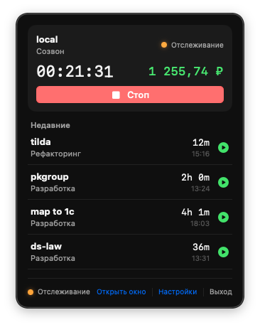
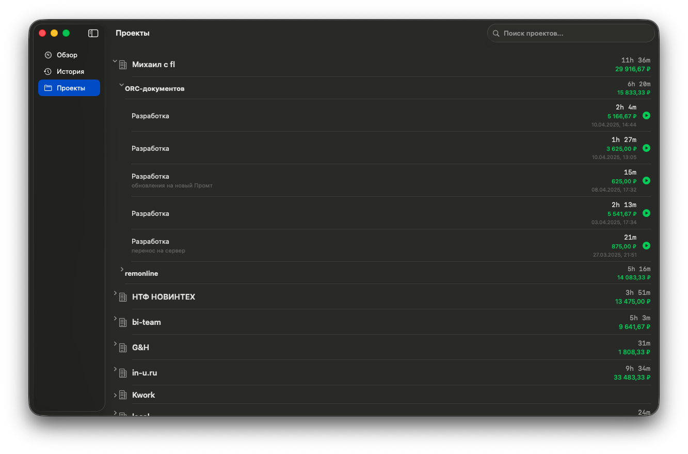

# Kimai Desktop для macOS

Нативный macOS-клиент для [Kimai](https://www.kimai.org/) — системы учёта рабочего времени. Попап в menu bar для быстрого доступа, полноценное окно для истории и аналитики.

Построен на SwiftUI с дизайном Liquid Glass (macOS 26 Tahoe).

## Скриншоты

| Попап в Menu Bar | Главное окно |
|:---:|:---:|
|  |  |

## Возможности

**Menu Bar**
- Живой таймер с отображением прошедшего времени и текущего заработка
- Быстрый старт/стоп трекинга из любого приложения
- Выбор проекта и активности
- Недавние записи с перезапуском в один клик

**Главное окно**
- **Обзор** — активный таймер, сводка за день, недельная разбивка по проектам
- **История** — таблица таймшитов с поиском, фильтрами по проекту и дате, пагинацией
- **Проекты** — иерархический список: Клиент > Проект > Записи с суммой заработка по группам

**Общее**
- Расчёт заработка по часовым ставкам проектов из Kimai API
- Безопасное хранение API-токена в macOS Keychain
- Настраиваемый интервал обновления, валюта и параметры отображения
- Скрипт сборки DMG для распространения

## Требования

- macOS 26 (Tahoe) или новее
- Сервер Kimai с доступом к API и Bearer-токен аутентификацией

## Установка

1. Соберите и запустите в Xcode или установите из DMG
2. Откройте **Настройки** (в футере попапа menu bar)
3. Введите URL сервера Kimai и API-токен
4. Нажмите **Test Connection**, затем **Save**

## Технологии

| Компонент | Технология |
|-----------|-----------|
| UI | SwiftUI, Liquid Glass, NavigationSplitView |
| Архитектура | MVVM, @Observable, @Environment |
| Сеть | URLSession (async/await actor) |
| Безопасность | Keychain Services |
| Конкурентность | Swift 6, MainActor |
| Таймер | DispatchSourceTimer (интервал 1 сек) |

## Сборка DMG

```bash
./scripts/build_dmg.sh
```

Результат: `build/Kimai_Desktop_v{version}_{build}.dmg`

## Используемые эндпоинты Kimai API

| Метод | Эндпоинт | Описание |
|-------|----------|----------|
| `GET` | `/api/users/me` | Проверка соединения |
| `GET` | `/api/projects` | Список проектов |
| `GET` | `/api/activities?project={id}` | Активности по проекту |
| `GET` | `/api/timesheets/active` | Активные таймшиты |
| `GET` | `/api/timesheets/recent` | Недавние записи |
| `GET` | `/api/timesheets?page&size&order&orderBy` | История с пагинацией |
| `POST` | `/api/timesheets` | Запуск таймера |
| `PATCH` | `/api/timesheets/{id}/stop` | Остановка таймера |
| `PATCH` | `/api/timesheets/{id}/restart` | Перезапуск таймера |
| `GET` | `/api/projects/{id}/rates` | Часовые ставки проекта |
| `GET` | `/api/activities/{id}/rates` | Ставки активности |

## Лицензия

MIT License
